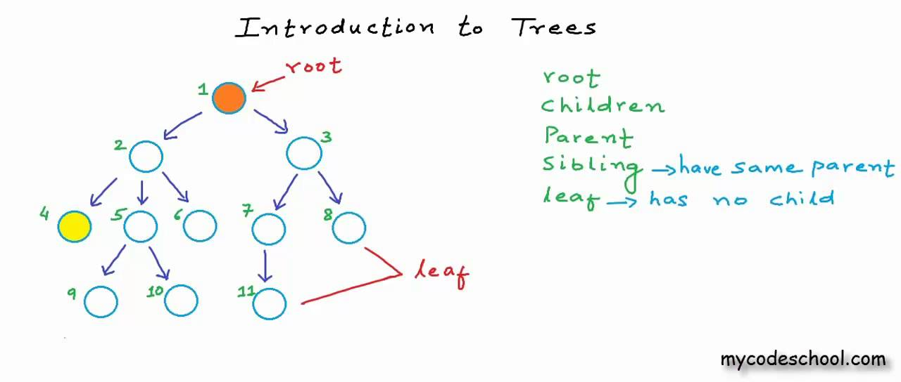
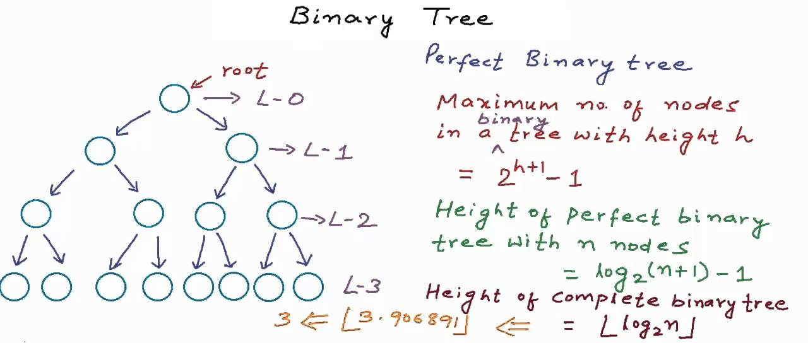
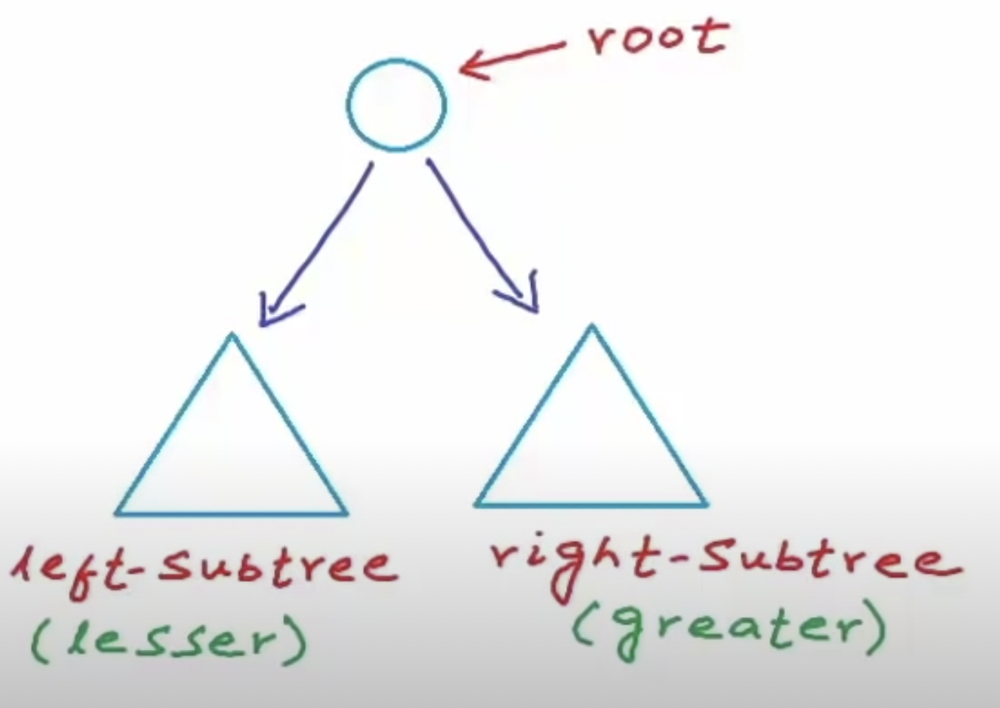
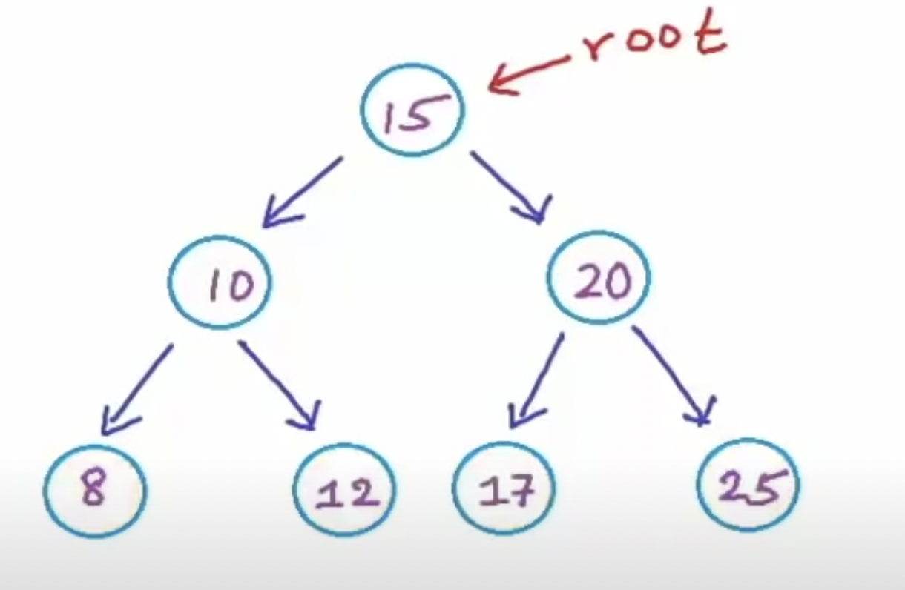

# Introduction to Trees

**A tree is non-linear and a hierarchical data structure consisting of a collection of nodes such that each node of the tree stores a value and a list of references to other nodes** (the “children”). This data structure is a specialized method to organize and store data in the computer to be used more effectively.

- In a tree with N nodes, there will be N-1 edges.
- We can create trees using dynamically allocated leafs and connect them using pointers



my-code-school youtube channel

### Applications:

1. Storing naturally hierarchical data e.g:- file systems
2. Binary search trees for quick search O(log_n)
3.  Trie to store dictionaries
4. Network routing algorithms

### We can define a node as the following:

```cpp
struct Node{
	int data;
	Node* left;
	Node* right;
}
```

### Binary Trees

**Binary trees** are trees that have at most two children.

**Strict/proper binary trees:** each node can have either 2 or 0 children

**Complete binary tree:** all levels except possibly the last are. completely filled and all nodes are as left as possible.

> Max no. of nodes at level `i = 2^i`

### Perfect Binary Tree

If all the levels are completely filled, such a tree can be called a *perfect binary tree.*  

> Maximum no. of nodes in a binary tree with height *h:  `2^(#levels) - 1`*


my-code-school youtube channel

### Balanced Binary Tree

Difference between height of left and right subtree for every node is not more than `k` (mostly `1`) 

- Height of an empty tree: `-1`
- Height of a tree with one node is: `0`

### How can we store binary trees:

- Dynamically created nodes
- Arrays
    - For complete binary tree
        - Left child index = `2i+1`
        - Right child index = `2i+2`

### Binary Search Tree

A BST is a binary tree in which for each node, the values of all the nodes in the left subtree are **lesser** and the values of the right subtree are **greater**

> The cost of searching, inserting and removing are all `O(logn)`
- The BST should be balanced for the aforementioned complexity!



